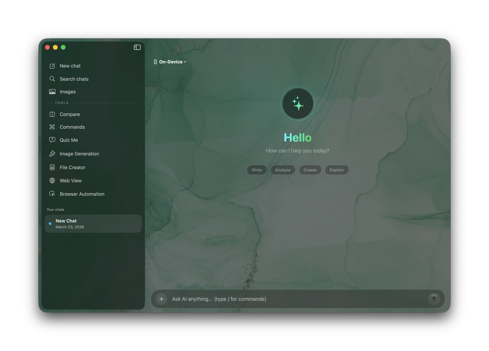

# Prism - Your Ultimate Native AI Companion for macOS

**Prism** is a powerful, native macOS application that brings modern AI directly to your desktop. Built with SwiftUI and designed with a stunning "Liquid Glass" and macOS Tahoe aesthetic, Prism integrates seamlessly into your Mac workflow. It offers a unified interface for Google Gemini, local Ollama models, Apple Foundation Models, and comprehensive system-wide AI writing assistance.

---

## 🚀 Key Features

### 🧠 Multi-Model Intelligence (APIs)
*   **Google Gemini**: Integrate your API key or use Gemini CLI. Includes support for Gemini 1.5 Pro, 1.5 Flash, and multimodal inputs (images, PDFs).
*   **GitHub Copilot Integration**: Access industry-leading models like GPT-4, Claude 3.5 Sonnet, and others directly using your existing Copilot subscription.
*   **NVIDIA NIM**: Connect your NVIDIA API key for high-performance cloud inference of Llama 3, Mistral, and more.
*   **Ollama Integration**: Run strictly private local models on your machine (gemma, llama3, qwen, deepseek, mistral). Zero data leaves your device.
*   **Apple Foundation Models**: Native on-device AI inference powered by Apple Intelligence directly on compatible Macs. Fast, private, and seamlessly integrated.

### ✍️ System-Wide AI Writing Layer
Transform any text field on your Mac into an AI-powered workspace using macOS Accessibility APIs:
*   **Inline AI Autocomplete**: Get intelligent, contextual text predictions directly at your cursor as you type in any application.
*   **Global Command Bar (IntelliBar)**: Summon a floating command bar to perform quick actions on selected text anywhere on your system.
*   **Personalized Writing Style**: Prism learns your unique writing style over time.
*   **Refinement Panel**: Rewrite, summarize, fix grammar, translate, and more.

### 🌐 Prism Browser Automation (Playwright & Puppeteer)
Prism includes a localized Node.js web automation server to control browsers agentically. Navigate, scrape, and interact with the web directly from the AI.

**How to set it up:**
1. Ensure Prism is running (it provides the local REST API on `localhost:8080`).
2. Open terminal: `cd BrowserAutomation`
3. Install dependencies: `npm install`
4. Start the automation server: `npm start`
5. Open your web browser and navigate to `http://localhost:9090` to access the Browser Automation dashboard and WebSocket stream.
6. Toggle between the **Playwright** and **Puppeteer** engines based on website compatibility.

### 🧩 Browser Extensions (Chrome & Safari)
Bring Prism's intelligence directly into your browser to enhance pages, extract context, and enable seamless agentic browser control.
*   **Chrome Extension**: Located in `Extensions/Chrome/`. Go to `chrome://extensions/`, enable "Developer mode", and click "Load unpacked" pointing to the folder.
*   **Safari Extension**: Located in `Extensions/Safari/`. Built seamlessly alongside the codebase with support for macOS native extension features.

### ⚡ Apple Shortcuts Integration
Automate your workflows! Prism embeds Shortcuts actions directly into macOS.
*   Find pre-configured Shortcuts in the `Shortcuts/` directory.
*   Includes `Ask AI Device`, `Ask AI Private`, `Ask ChatGPT`, `Generate Image ChatGPT`, and `Generate Image`.
*   Double-click any `.shortcut` file to add it to your Shortcuts app, then assign to global hotkeys or Siri.

### 🖥️ Versatile Interfaces
Prism adapts to how you work with multiple entry points, all **synchronized** in real-time:
1.  **Main Window**: A full-featured chat interface for deep work and long conversations.
2.  **Menu Bar App**: Always one click away for quick questions and status checks.
3.  **Quick AI Panel** (`Ctrl + Space`): A Spotlight-like floating search bar. Summon it instantly from anywhere to ask a question, then dismiss it just as fast.
4.  **Interactive Web Overlay**: A dedicated, floating web view panel for quick internet access and searches alongside your AI.
5.  **Browser Extensions (Chrome & Safari)**: Bring Prism's intelligence directly into your browser. Enhance web pages, extract content, and enable seamless agentic browser control.

### 🔀 Model Comparison Mode
*   **Side-by-Side Comparison**: Send the same prompt to multiple AI models simultaneously and compare their responses.
*   **Add Unlimited Slots**: Compare as many models as you want from any provider.
*   **AI Synthesis**: Use the "Synthesize" feature to combine all responses into a single, unified best answer using AI.
*   **Performance Tracking**: View elapsed time and generation speed for each model response.

### 🎭 Rich Chat Experience
*   **Multimodal Input**: Drag and drop or paste **multiple images** simultaneously to analyze them. Attach PDFs and have AI process their contents.
*   **Professional PDF Export**: Convert any chat or markdown text into a professionally formatted PDF document with customizable page sizes (Letter, A4, Legal) and high-quality math rendering.
*   **Advanced Math Rendering**: Beautiful LaTeX rendering for complex block equations (`$$...$$`) and seamless inline math support (`$...$`) with automatic symbol conversion.
*   **Code Highlighting**: Syntax highlighting for all major programming languages with one-click copy.
*   **Thinking Process**: View the internal "thought process" of reasoning models (like DeepSeek R1) in a beautifully animated, collapsible section.
*   **Global Sync**: Start a chat in the Quick Panel, continue it in the Menu Bar, and finish it in the Main Window.

### 🎨 Image & Video Generation
*   **AI Image Creation**: Generate stunning visuals using AI. Includes support for custom aspect ratios and ultra-high resolution **4K generation**.
*   **Local Image Generation**: Run image generation securely and privately on your machine using Ollama integration.
*   **Video Generation (Veo)**: Create dynamic AI videos directly within Prism with a premium integrated video player UI.
*   **Multiple Styles**: Choose from various styles including Animation, Illustration, Sketch (Apple Intelligence) and Watercolor, Vector, Anime, Print (ChatGPT).
*   **Persistent Gallery**: All generated images and videos are saved and accessible in a gallery view.

### ❓ Quiz Me Mode
*   **AI-Generated Quizzes**: Enter any topic and have AI generate a customized multiple-choice quiz.
*   **Configurable Difficulty & Length**: Choose from Easy, Medium, or Hard difficulty levels, and set your desired question count.
*   **Instant Feedback**: Get immediate scoring and detailed explanations for your answers.

### ⚡ Slash Commands & Prompt Templates
*   **Built-in Commands**: Quick access to common actions like `/summarize`, `/explain`, `/translate`, `/fix`, `/code`, and `/rewrite`.
*   **Custom Prompt Templates**: Create your own reusable prompt templates and slash commands with custom icons and expansions. Type `/` anywhere to see available commands with real-time filtering.

### 🔍 Search & Reasoning
*   **Integrated Web Search**: Enable web search to let AI access real-time information from the internet.
*   **Configurable Thinking Levels**: Adjust AI thinking depth (Low, Medium, High) for reasoning models.

### ⚡️ Performance & Design
*   **Native macOS**: Built with SwiftUI for blazing fast performance and low memory footprint.
*   **Streaming**: Character-by-character streaming responses for immediate feedback.
*   **Liquid Glass Aesthetic**: Sleek, modern UI with glassmorphism effects and macOS Tahoe design cues.
*   **Highly Customizable**: Personalize your experience with custom themes, adjustable opacity, default models, and system prompts.
*   **Background Mode**: Prism runs silently in the background without cluttering your Dock, available instantly via hotkey.
*   **Automatic Updates**: Built-in over-the-air update system keeps your app on the latest version seamlessly.

---

## 📥 Installation

### Option 1: Download Release
1.  Go to the **[Releases](../../releases)** page.
2.  Download the latest `Prism_Installer.dmg`.
3.  Open the disk image and drag **Prism** to your **Applications** folder.
4.  Launch Prism!

> **Note**: On first launch, you may need to right-click the app and select "Open" if Gatekeeper prompts you. You will also need to grant Accessibility permissions for the system-wide AI Writing Layer features to function.

### Option 2: Clone & Build from Source
If you prefer to build the project yourself or contribute to development, you can clone the repository:
* **HTTPS**: `git clone https://github.com/gl-aarav/PrismApp.git`
* **SSH**: `git clone git@github.com:gl-aarav/PrismApp.git`
* **GitHub CLI**: `gh repo clone gl-aarav/PrismApp`

Once cloned, open `Package.swift` or the project directory in Xcode, wait for Swift Package dependencies to resolve, and build (`Cmd + R`).

---

## ⚙️ Configuration

Click the **Gear Icon** in the main window to access Settings:

### 1. Model Providers
*   **Google Gemini**: Get your API key from [Google AI Studio](https://aistudio.google.com/), or authenticate securely using the integrated Gemini CLI.
*   **GitHub Copilot**: Sign in with your GitHub account to enable Copilot-powered models.
*   **NVIDIA NIM**: Enter your NVIDIA API key for high-performance Llama models.
*   **Ollama**: Install [Ollama](https://ollama.com/) and run `ollama serve`. Use `ollama run llama3` to pull models.
*   **Apple Intelligence**: Select Apple Foundation Models for on-device processing (requires compatible Mac).

### 2. System Prompt & Hotkeys
*   Customize the system prompt to set the AI's personality and behavior.
*   Change the default **Quick AI Hotkey** (default: `Control + Space`).

---

## 📝 Usage Tips

### System-Wide Writing Assistance
Highlight any text in any app and invoke the Quick AI Hotkey to bring up the Refinement Panel or IntelliBar to instantly rewrite, summarize, or fix your text. Enable AI Autocomplete in settings to get inline suggestions as you type.

### Math & LaTeX
Prism supports extensive LaTeX formatting:
*   **Fractions**: `\frac{a}{b}` converts to `(a)/(b)` inline.
*   **Greek**: `\alpha`, `\beta`, `\Delta` convert to α, β, Δ.
*   **Roots**: `\sqrt{x}` converts to `√(x)`.
*   **Boxed**: `\boxed{answer}` highlights the result.

---

## 🔒 Privacy

*   **Local Storage**: All chat history is stored locally on your Mac in JSON format.
*   **Ollama & Apple Intelligence**: When using local models, your data never leaves your computer.
*   **Direct Connections**: Prism connects directly to the APIs you configure. No middleman servers intercept your prompts.

---

## 📄 License

Prism is open-source software!

---

## ℹ️ Disclaimer

**Prism is an independent, personal project. It is not affiliated with, endorsed by, or belonging to any company or organization.**

---

**Developed by Aarav Goyal**
